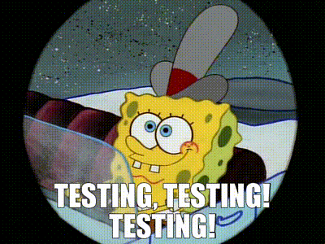

# 🧪 JestLab


<p align="center">
  
</p>

**JestLab** is a terminal-based testing playground built with **TypeScript**, **Jest**, and **Inquirer**.  
It provides an interactive CLI that allows you to run tests on individual components or specific test cases with clean, minimal output — perfect for practicing test-driven development or building reusable test tools.

---

## 🚀 Features

- ✅ Run all tests or individual test cases interactively
- 📋 Inquirer-powered menus for clean test selection
- 🎯 Filtered output: only show the most useful summary of test results
- ✨ Supports intentional failing tests for learning or demonstration

---

## 🧪 Test Suites Included

- 🔘 `Button` — label rendering, click handler, disabled state
- ⌨️ `Input` — value rendering, onChange, placeholder, disabled
- 💥 `Fail Example` — test purposely designed to fail for demo

---

## 🧠 Tech Stack

- **Core:** TypeScript, Node.js
- **Testing:** Jest, React Testing Library
- **CLI Tools:** Inquirer.js, Chalk

---

## 📦 Getting Started

```bash
# Clone the project
git clone https://github.com/Mo2207/jestlab.git
cd jestlab

# Install dependencies
npm install

# Start the CLI
npm start